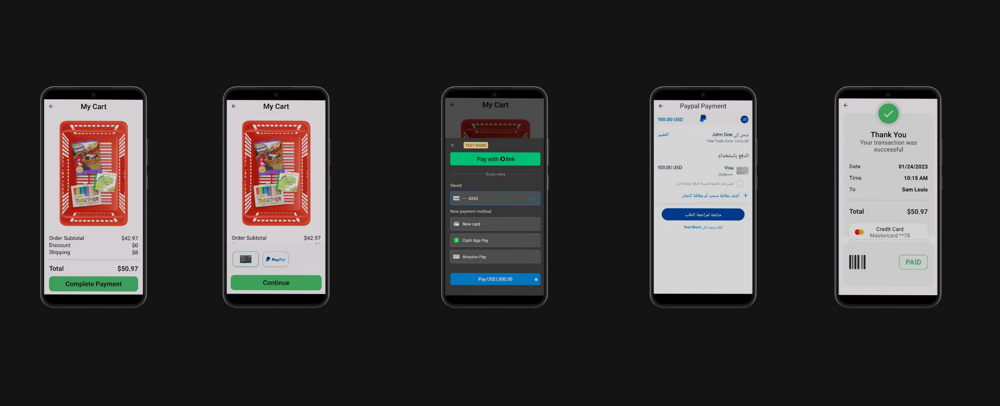
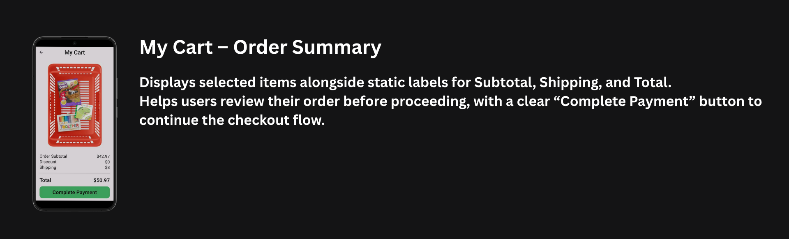
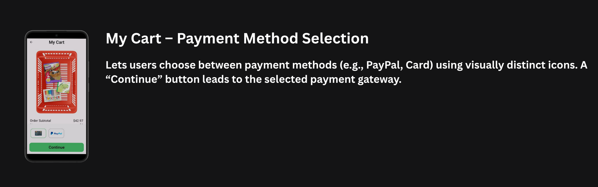
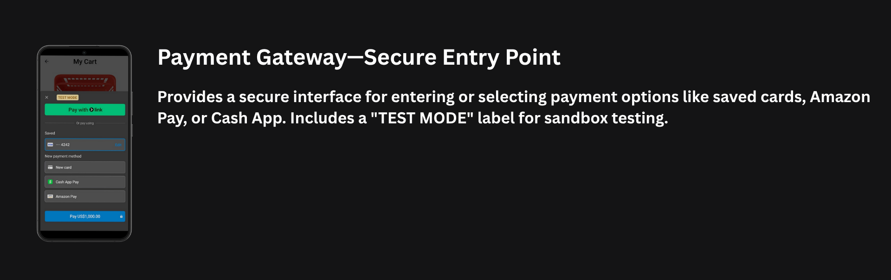
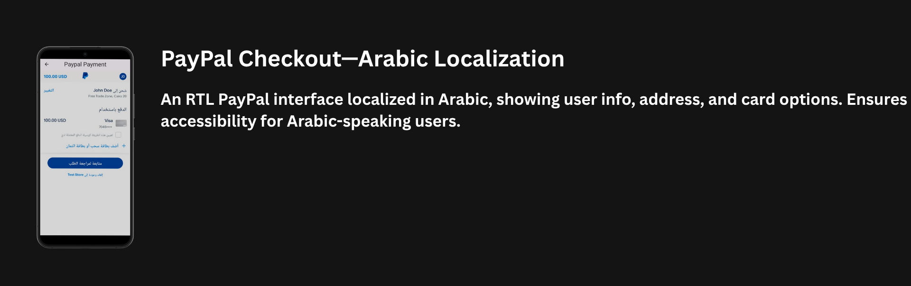
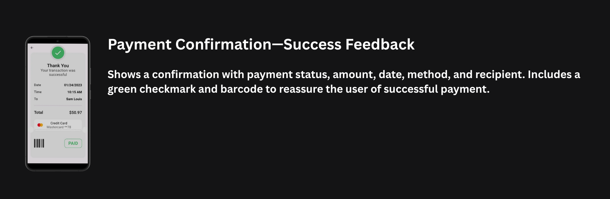

# 💳 Checkout Feature

A modular UI component for handling the full checkout experience in a Flutter e-commerce app, including:

🧺 Order summary with totals  
💳 Multiple payment method support  
🌐 Localized checkout (Arabic PayPal)  
✅ Final confirmation with receipt

  

---

## 🎨 Screens

🧾 My Cart: Displays order subtotal, shipping, and total with a "Complete Payment" button

  

💳 Payment Selection: Lets users choose between PayPal and Card with visual icons

  

🔐 Payment Gateway: A secure screen to enter card details or select saved methods (Test Mode enabled)

  

🌍 PayPal Arabic: RTL PayPal screen with user info and card selection in Arabic

  

✅ Confirmation: Final success view with transaction summary, green status, and barcode receipt

  

---

## 🛠️ Tech Stack

📱 Frontend
- Framework: Flutter.
- State Management: Bloc. 

🌐 Integration
- Stripe / PayPal API (Test Mode Supported)

📦 Dependencies
- `flutter_credit_card` / `flutter_bloc` / `flutter_stripe` / `flutter_paypal_payment` / `dio` / `dartz` / `font_awesome_flutter` / `svg_flutter`

---

## 🏗️ Architecture
  - 🧩 MVVM pattern

